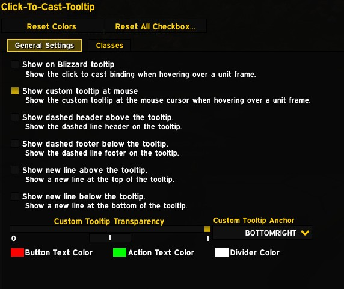

# Click-To-Cast-Tooltip

Click-To-Cast-Tooltip is a World of Warcraft addon that displays a dynamic tooltip showing which spells, macros, or actions you can cast based on your current modifier keys (Shift, Alt, Ctrl) and mouse button.

## Features

- Custom tooltip at mouse cursor showing available click-cast bindings
- Blizzard tooltip integration for unit frames
- Clique addon integration: show your Clique click-cast bindings in the tooltip
- Full support for party, raid, boss, arena, and pet frames
- Works with Blizzard, ElvUI, Cell, Grid2, and other major unit frame addons
- Highly configurable appearance and behavior

## Screenshots

### Settings Panel

Access the settings via `/ctctt` or through `Esc → Options → AddOns → Click-To-Cast Tooltip`:

### Class Color Settings

Customize colors for buttons and actions:

### Example Blizzard Tooltip

Blizzard tooltip with all options enabled (shown with ElvUI):

### Mouseover Tooltip

Tooltip appears at your mouse cursor when hovering unit frames:

## Slash Commands

- `/ctctt` and `/clicktocasttooltip`
  Opens the options panel for the addon.

## Settings Overview

All settings are available in the options panel. Here’s what you can configure:

### Tooltip Appearance

- **Show Custom Tooltip**: Enable/disable the custom tooltip at your mouse.
- **Tooltip Anchor**: Set the anchor point for the tooltip (e.g., BOTTOMRIGHT, TOPLEFT).
- **Tooltip Transparency**: Adjust the transparency of the tooltip.

### Blizzard Tooltip Integration

- **Show Blizzard Tooltip**: Enable/disable extra lines in the Blizzard tooltip.
- **Show Header/Footer**: Add dashed lines above/below the tooltip for clarity.
- **Show New Line Top/Bottom**: Add empty lines for spacing.

### Colors

- **Button Color**: Set the color for mouse button names.
- **Action Color**: Set the color for spell/macro/action names.
- **Divider Color**: Set the color for header/footer lines.

### Spec Toggles

- **Spec-Specific Enable/Disable**: Enable or disable the tooltip for each specialization.

## Supported Unit Frames

- Blizzard: Player, Target, Focus, Pet, Party, Raid, Boss, Arena, and more
- ElvUI: All major unit frames, including party/raid/arena
- Cell: Party, raid, pet, spotlight, quick assist, and more
- Grid2: All raid and party frames (e.g., Grid2LayoutHeader1UnitButton1, etc.)
- Shadowed Unit Frames (SUF): Player, pet, target, focus, raid, main tank, main assist, and more (e.g., SUFHeaderraidUnitButton1, SUFHeadermaintankUnitButton1, etc.)

## Clique Addon Support

- If you use the popular [Clique](https://www.curseforge.com/wow/addons/clique) addon for click-casting, Click-To-Cast-Tooltip will automatically detect and display your Clique bindings in the tooltip.
- You can choose to show only Clique bindings, only Blizzard bindings, or both (configurable in the settings).
- On first load with Clique installed, you'll be prompted to disable Blizzard bindings for a cleaner experience (one-time prompt).

## How It Works

When you hover over a unit frame, the addon scans your click-cast bindings and displays a tooltip showing which actions are available for the current modifier keys and mouse button. The tooltip updates dynamically as you press or release modifier keys.

## Feedback & Support

If you encounter issues or have feature requests, please open an issue on GitHub.
